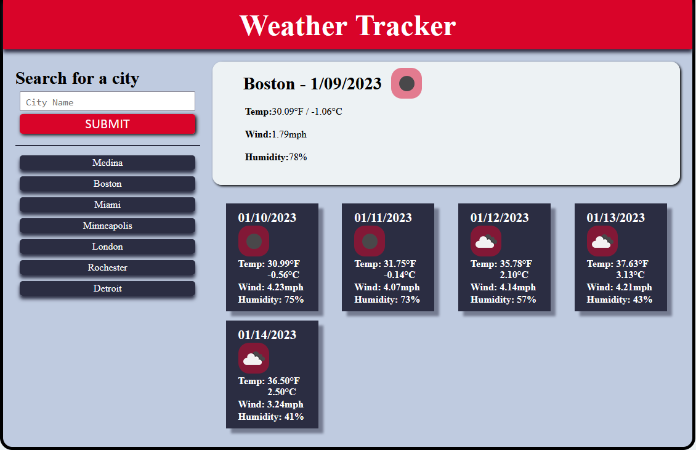

# weather-tracker

## Description

This is a class assignment that required us to build a weather dashboard, query a 3rd party weather API and display the data on the page, then save search history into localStorage.  It meets the following acceptance criteria:

- GIVEN a weather dashboard with form inputs

- WHEN I search for a city, THEN I am presented with current and future conditions for that city and that city is added to the search history
- WHEN I view current weather conditions for that city, THEN I am presented with the city name, the date, an icon representation of weather conditions, the temperature, the humidity, and the wind speed
- WHEN I view future weather conditions for that city, THEN I am presented with a 5-day forecast that displays the date, an icon representation of weather conditions, the temperature, the wind speed, and the humidity
- WHEN I click on a city in the search history, THEN I am again presented with current and future conditions for that city

I added additional functionality to handle additional edge cases:
- Added event listener for input keydown events on 'Enter' & 'Return' to submit query
- Check for duplicates in search history
- Don't repopulate city in search history if a past result is clicked
- Limit search history to 10
- Mousing over a weather icon returns the condition value passed by the API due to poor icon quality

## Table of Contents

- [Installation](#installation)
- [Usage](#usage)
- [Credits](#credits)
- [License](#license)

## Installation

Runs in the browser for mobile, tablet, laptop, and PC devices.

## Usage

You can visit the live application at - https://maximusdecimalusmeridius.github.io/weather-tracker.

## Credits
Weather data is returned using the OpenWeather API found at https://openweathermap.org/

## License

MIT License - Please refer to the LICENSE in the repo.

This favicon was generated at favicon.io using the following font:
- Font Title: Leckerli One
- Font Author: Copyright (c) 2011 Gesine Todt (www.gesine-todt.de), with Reserved Font Names "Leckerli"
- Font Source: http://fonts.gstatic.com/s/leckerlione/v16/V8mCoQH8VCsNttEnxnGQ-1itLZxcBtItFw.ttf
- Font License: SIL Open Font License, 1.1 (http://scripts.sil.org/OFL))
